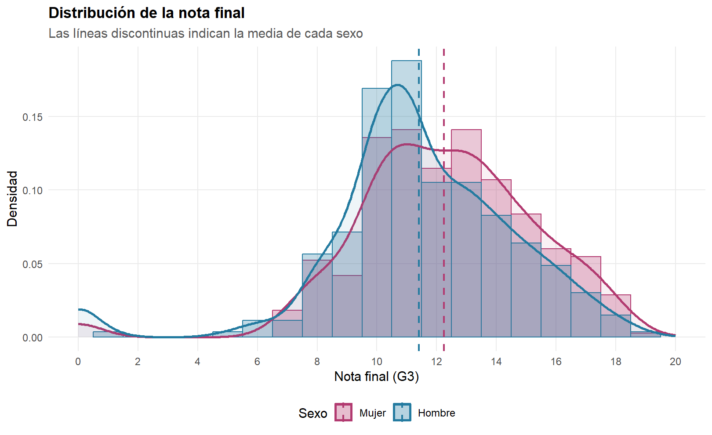
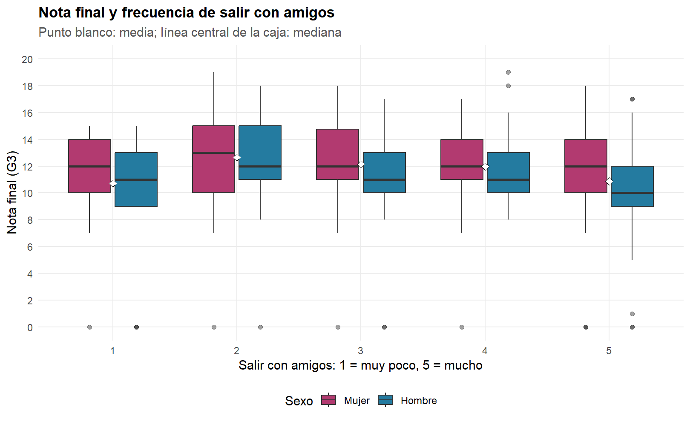
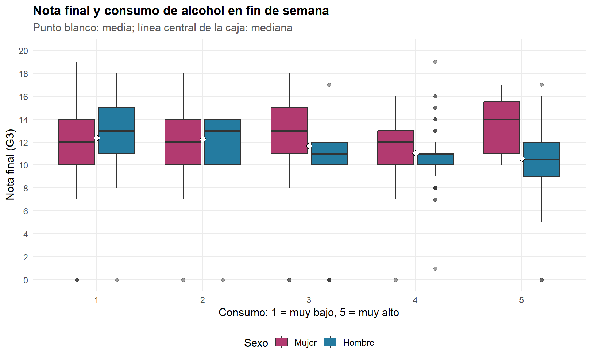
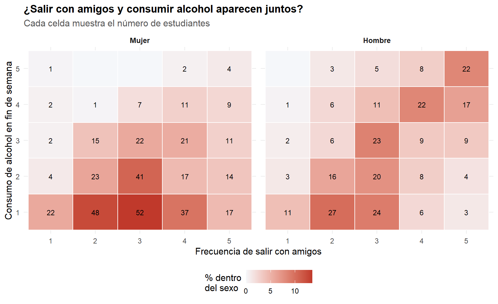
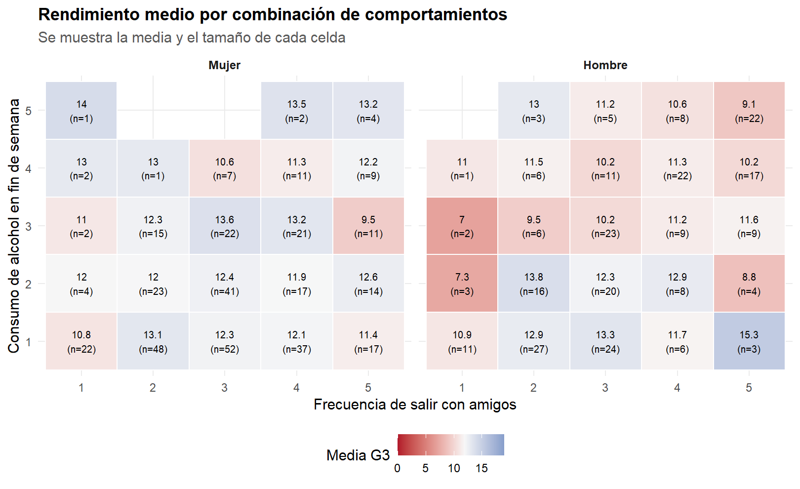
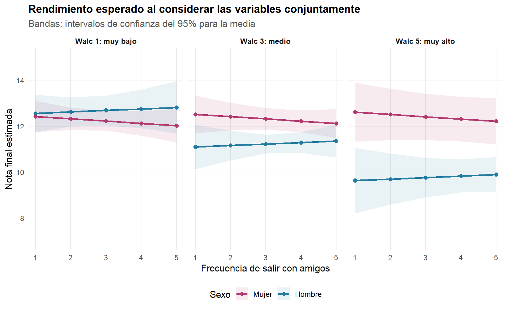
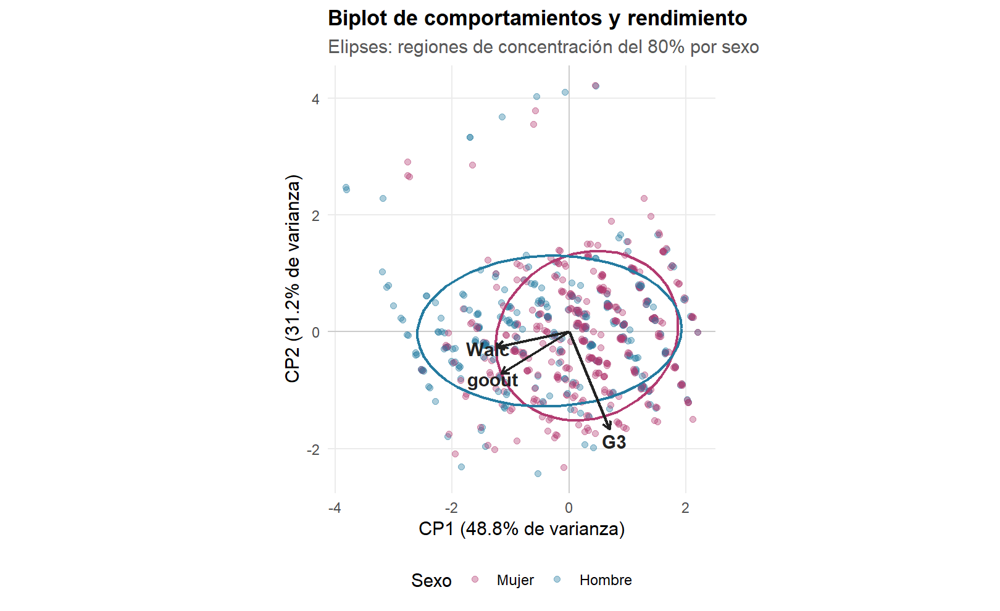

Salir con amigos, consumo de alcohol y rendimiento académico
================
Proyecto Métodos Estadísticos Avanzados I
06/08/2026

- [Pregunta de investigación](#pregunta-de-investigación)
  - [Variables](#variables)
- [Preparación y calidad de los
  datos](#preparación-y-calidad-de-los-datos)
- [Análisis descriptivo](#análisis-descriptivo)
  - [Figura 1. Distribución de la nota
    final](#figura-1-distribución-de-la-nota-final)
  - [Figura 2. Rendimiento según la frecuencia de salir con
    amigos](#figura-2-rendimiento-según-la-frecuencia-de-salir-con-amigos)
  - [Figura 3. Rendimiento según el consumo de alcohol del fin de
    semana](#figura-3-rendimiento-según-el-consumo-de-alcohol-del-fin-de-semana)
  - [Figura 4. Relación entre salir con amigos y consumir
    alcohol](#figura-4-relación-entre-salir-con-amigos-y-consumir-alcohol)
  - [Figura 5. Media de rendimiento para cada
    combinación](#figura-5-media-de-rendimiento-para-cada-combinación)
- [Asociación estadística](#asociación-estadística)
  - [Modelo conjunto considerando el
    sexo](#modelo-conjunto-considerando-el-sexo)
  - [Figura 6. Tendencias ajustadas por
    sexo](#figura-6-tendencias-ajustadas-por-sexo)
- [Biplot de componentes
  principales](#biplot-de-componentes-principales)
- [Análisis de sensibilidad](#análisis-de-sensibilidad)
- [Conclusiones](#conclusiones)
- [Guion para video de dos minutos](#guion-para-video-de-dos-minutos)

# Pregunta de investigación

> **¿Qué relación existe entre salir con amigos, consumir alcohol los
> fines de semana y el rendimiento académico, considerando el sexo del
> estudiante?**

El objetivo es describir y cuantificar la asociación entre la frecuencia
de salir con amigos (`goout`), el consumo de alcohol durante el fin de
semana (`Walc`) y la nota final de portugués (`G3`), diferenciando los
resultados por sexo (`sex`). Al tratarse de datos observacionales, los
resultados permiten hablar de **asociaciones**, pero no demostrar
causalidad.

## Variables

| Variable | Papel en el análisis | Escala |
|:---|:---|:---|
| `G3` | Rendimiento académico | Cuantitativa discreta, de 0 a 20 |
| `goout` | Frecuencia de salir con amigos | Ordinal: 1 = muy baja, 5 = muy alta |
| `Walc` | Consumo de alcohol el fin de semana | Ordinal: 1 = muy bajo, 5 = muy alto |
| `sex` | Variable de comparación | Nominal: F = mujer, M = hombre |

# Preparación y calidad de los datos

La base contiene **649 estudiantes**, **35 variables**, **0 datos
faltantes** y **0 filas exactamente duplicadas**. Los **15 casos con
nota final igual a cero (2.3%)** se conservan porque el diccionario
admite calificaciones entre 0 y 20. Más adelante se realiza un análisis
de sensibilidad para comprobar si esos casos cambian las conclusiones.

# Análisis descriptivo

| Variable | Media | Mediana | Moda | Minimo | Maximo | Rango | Desviacion | Varianza |
|:---|---:|---:|---:|---:|---:|---:|---:|---:|
| Nota final (G3) | 11.91 | 12 | 11 | 0 | 19 | 19 | 3.23 | 10.44 |
| Salir con amigos (goout) | 3.18 | 3 | 3 | 1 | 5 | 4 | 1.18 | 1.38 |
| Alcohol fin de semana (Walc) | 2.28 | 2 | 1 | 1 | 5 | 4 | 1.28 | 1.65 |

Resumen de las variables principales

| Sexo   |   n | Porcentaje | Media_G3 | Mediana_G3 | DE_G3 | Media_goout | Media_Walc |
|:-------|----:|-----------:|---------:|-----------:|------:|------------:|-----------:|
| Mujer  | 383 |         59 |    12.25 |         12 |  3.12 |        3.13 |       1.94 |
| Hombre | 266 |         41 |    11.41 |         11 |  3.32 |        3.27 |       2.77 |

Descripción por sexo

## Figura 1. Distribución de la nota final

Distribución de la nota final de portugués según el sexo.

**Interpretación.** La gráfica permite comparar forma, centro y
dispersión. La nota media es 12.25 para las mujeres y 11.41 para los
hombres. Las distribuciones se superponen ampliamente; por tanto,
cualquier diferencia por sexo debe interpretarse por su magnitud y no
solo por su significación estadística. También se observa un pequeño
grupo con `G3 = 0`, válido en la escala pero separado del cuerpo
principal de notas.

## Figura 2. Rendimiento según la frecuencia de salir con amigos

Nota final según la frecuencia de salir con amigos, separada por sexo.

**Interpretación.** Las cajas muestran la variabilidad completa dentro
de cada nivel. La media pasa de 10.73 en el nivel 1 a 10.87 en el nivel
5. Sin embargo, existe bastante solapamiento entre grupos: salir con
mayor frecuencia no determina por sí solo la nota. La separación por
sexo permite comprobar visualmente si el patrón tiene una dirección
similar en mujeres y hombres.

## Figura 3. Rendimiento según el consumo de alcohol del fin de semana

Nota final según el consumo de alcohol de fin de semana, separada por
sexo.

**Interpretación.** La media de `G3` es 12.36 en el nivel 1 y 10.56 en
el nivel 5. La lectura debe considerar el ancho de las cajas y el tamaño
desigual de los grupos: los niveles altos de consumo son menos
frecuentes, especialmente al separar por sexo, de modo que sus medias
son menos estables.

## Figura 4. Relación entre salir con amigos y consumir alcohol

Distribución conjunta de goout y Walc dentro de cada sexo.

**Interpretación.** Las concentraciones de celdas permiten ver qué
combinaciones son habituales y cuáles tienen pocos casos. La correlación
de Spearman entre `goout` y `Walc` es **0.372** (\`p \< 0,001). Esto
indica que quienes reportan salir más también tienden a declarar mayor
consumo durante el fin de semana. Por ello, las dos variables no deben
interpretarse de forma aislada.

## Figura 5. Media de rendimiento para cada combinación

Nota media para cada combinación de goout y Walc.

**Interpretación.** Este mapa evita atribuir a `goout` una diferencia
que podría estar asociada con `Walc`, o viceversa. Las celdas azules
tienen medias superiores y las rojas inferiores. Las celdas con un `n`
pequeño deben leerse con cautela: una o dos notas pueden mover
considerablemente su promedio. El patrón global es más importante que
una celda aislada.

# Asociación estadística

| Analisis                     | Estadistico |        p |
|:-----------------------------|------------:|---------:|
| Spearman: goout con G3       |      -0.105 |    0,007 |
| Spearman: Walc con G3        |      -0.171 | \< 0,001 |
| Kruskal-Wallis: G3 por goout |      19.766 | \< 0,001 |
| Kruskal-Wallis: G3 por Walc  |      24.297 | \< 0,001 |

Pruebas bivariadas

Las correlaciones de Spearman son apropiadas porque `goout` y `Walc` son
escalas ordinales. Kruskal-Wallis contrasta si la distribución de las
notas es igual en los cinco niveles sin exigir normalidad. Un valor *p*
pequeño aporta evidencia de diferencias, pero **no mide su importancia
práctica**; por eso se reportan también las correlaciones y las
diferencias observadas en las gráficas.

## Modelo conjunto considerando el sexo

Para estimar la asociación parcial de cada comportamiento se ajusta un
modelo lineal exploratorio. `goout` y `Walc` se usan como escalas de 1 a
5 para estimar una tendencia promedio por cada incremento de nivel. Se
incluyen interacciones con el sexo para evaluar si las pendientes
cambian entre mujeres y hombres.

| Termino | Estimacion | Error_estandar | t | p |
|:---|---:|---:|---:|---:|
| Intercepto: mujer, goout=0, Walc=0 | 12.474 | 0.501 | 24.879 | \< 0,001 |
| Tendencia de goout en mujeres | -0.100 | 0.144 | -0.691 | 0,490 |
| Tendencia de Walc en mujeres | 0.047 | 0.157 | 0.297 | 0,767 |
| Diferencia hombre-mujer | 0.744 | 0.762 | 0.977 | 0,329 |
| Cambio de la pendiente goout en hombres | 0.165 | 0.240 | 0.689 | 0,491 |
| Cambio de la pendiente Walc en hombres | -0.777 | 0.226 | -3.436 | \< 0,001 |

Modelo lineal: G3 explicado por goout, Walc, sexo e interacciones

El modelo explica **5.6% de la variabilidad de `G3`** (R² ajustado =
0.049). Por tanto, aunque alguno de los coeficientes sea
estadísticamente distinto de cero, `goout`, `Walc` y `sex` constituyen
solo una parte pequeña del rendimiento: hábitos de estudio, antecedentes
académicos, apoyo y otras variables no incluidas también son relevantes.

La pendiente estimada de `goout` para mujeres es -0.1 puntos de `G3` por
nivel, y la de `Walc` es 0.047. Para hombres, las pendientes son 0.066 y
-0.731, respectivamente. Las interacciones indican si esas diferencias
de pendiente reciben apoyo estadístico.

## Figura 6. Tendencias ajustadas por sexo

Predicciones del modelo conjunto para combinaciones de goout y Walc.

**Interpretación.** Las líneas resumen el modelo, manteniendo
simultáneamente `goout`, `Walc` y sexo. Líneas casi horizontales
representan asociaciones débiles; diferencias claras de inclinación
entre mujeres y hombres representarían interacción. Las bandas se
amplían en combinaciones poco frecuentes, lo que refleja mayor
incertidumbre y evita sobreinterpretar los extremos.

# Biplot de componentes principales

El biplot resume conjuntamente `goout`, `Walc` y `G3`. Las variables se
estandarizan para que sus diferentes dispersiones sean comparables.
Debido a que dos variables son ordinales, el PCA se usa únicamente como
**visualización exploratoria**.

Biplot de goout, Walc y G3; puntos coloreados por sexo.

|       | Variable |    CP1 |   CP2 |
|:------|:---------|-------:|------:|
| goout | goout    | -0.635 | -0.39 |
| Walc  | Walc     | -0.674 | -0.14 |
| G3    | G3       |  0.376 | -0.91 |

Cargas de las variables en los dos primeros componentes

**Interpretación del biplot.** Flechas en direcciones similares
representan asociación positiva; flechas opuestas representan asociación
negativa y flechas cercanas a 90° indican poca relación lineal. La
proximidad de las flechas `goout` y `Walc` refleja que ambos
comportamientos tienden a aumentar juntos. La dirección de `G3` respecto
a ellas muestra si el rendimiento se opone o acompaña ese patrón. La
superposición de las elipses indica cuánto se parecen los perfiles
multivariados de mujeres y hombres. Los dos primeros componentes
explican conjuntamente **80%** de la variabilidad estandarizada.

# Análisis de sensibilidad

| Muestra               |   n | Pendiente_goout_mujer | Pendiente_Walc_mujer |    R2 |
|:----------------------|----:|----------------------:|---------------------:|------:|
| Todos los estudiantes | 649 |                 -0.10 |                0.047 | 0.056 |
| Excluyendo G3 = 0     | 634 |                 -0.03 |                0.070 | 0.069 |

Sensibilidad de los resultados ante las notas finales iguales a cero

La comparación permite comprobar si los ceros dominan la dirección de
las asociaciones. Si las pendientes conservan su signo y una magnitud
parecida, la conclusión es estable. Si cambian notablemente, debe
informarse que los resultados dependen de cómo se trate a quienes
obtuvieron cero.

# Conclusiones

1.  `goout` y `Walc` están relacionados entre sí; quienes salen más
    tienden a reportar mayor consumo de alcohol durante el fin de
    semana.
2.  La asociación de cada comportamiento con `G3` debe evaluarse
    conjuntamente, ya que analizarlos por separado puede confundir sus
    efectos descriptivos.
3.  Las diferencias visuales entre niveles presentan solapamiento
    considerable: estos hábitos no permiten predecir por sí solos la
    nota de un estudiante.
4.  El sexo ayuda a describir posibles diferencias de nivel o pendiente,
    pero las interacciones del modelo determinan si el patrón cambia de
    manera estadísticamente apreciable.
5.  El bajo R² del modelo muestra que la mayor parte de la variabilidad
    del rendimiento se relaciona con otros factores no incluidos en esta
    pregunta.
6.  Los resultados son asociaciones de una muestra observacional. No
    permiten afirmar que salir o consumir alcohol **cause** cambios en
    el rendimiento.

# Guion para video de dos minutos

> **0:00–0:15 — Presentación**  
> En este estudio analizamos 649 estudiantes del curso de portugués.
> Nuestra pregunta fue: ¿qué relación existe entre salir con amigos,
> consumir alcohol los fines de semana y el rendimiento académico,
> considerando el sexo del estudiante?
>
> **0:15–0:30 — Variables y calidad**  
> Utilizamos la nota final, llamada G3, como medida de rendimiento; la
> frecuencia de salir con amigos, goout; el consumo de alcohol del fin
> de semana, Walc; y el sexo. La base no tiene datos faltantes ni filas
> duplicadas, por lo que estaba lista para el análisis.
>
> **0:30–0:50 — Descripción inicial**  
> Primero observamos la distribución de las notas por sexo. Las dos
> distribuciones se superponen ampliamente, aunque sus promedios
> presentan una pequeña diferencia. También conservamos las quince notas
> iguales a cero porque son valores permitidos por el diccionario.
>
> **0:50–1:15 — Resultados principales**  
> Los diagramas de caja muestran cómo cambia la nota entre los cinco
> niveles de salir con amigos y de consumo de alcohol. Hay diferencias
> entre algunos promedios, pero también bastante variabilidad dentro de
> cada grupo. Además, el mapa de frecuencias muestra que salir y
> consumir alcohol están relacionados: quienes salen con mayor
> frecuencia tienden a registrar mayor consumo durante el fin de semana.
>
> **1:15–1:35 — Modelo y sexo**  
> Para separar estas relaciones ajustamos un modelo que considera
> simultáneamente salir, consumir alcohol y el sexo. Las líneas
> representan el rendimiento esperado y las bandas muestran la
> incertidumbre. El modelo explica solamente 5.6 por ciento de la
> variabilidad de las notas, así que estos comportamientos son solo una
> parte del rendimiento académico.
>
> **1:35–1:50 — Biplot**  
> El biplot resume las tres variables. Las flechas de salir con amigos y
> consumo de alcohol apuntan en direcciones semejantes, confirmando su
> asociación. La orientación de la nota final muestra cómo se relaciona
> el rendimiento con ese patrón, mientras que las elipses comparan los
> perfiles de mujeres y hombres.
>
> **1:50–2:00 — Conclusión**  
> Concluimos que existe una asociación entre los hábitos sociales y el
> rendimiento, pero es débil y no demuestra causalidad. Otros factores
> académicos y familiares explican gran parte de las diferencias en las
> notas.
