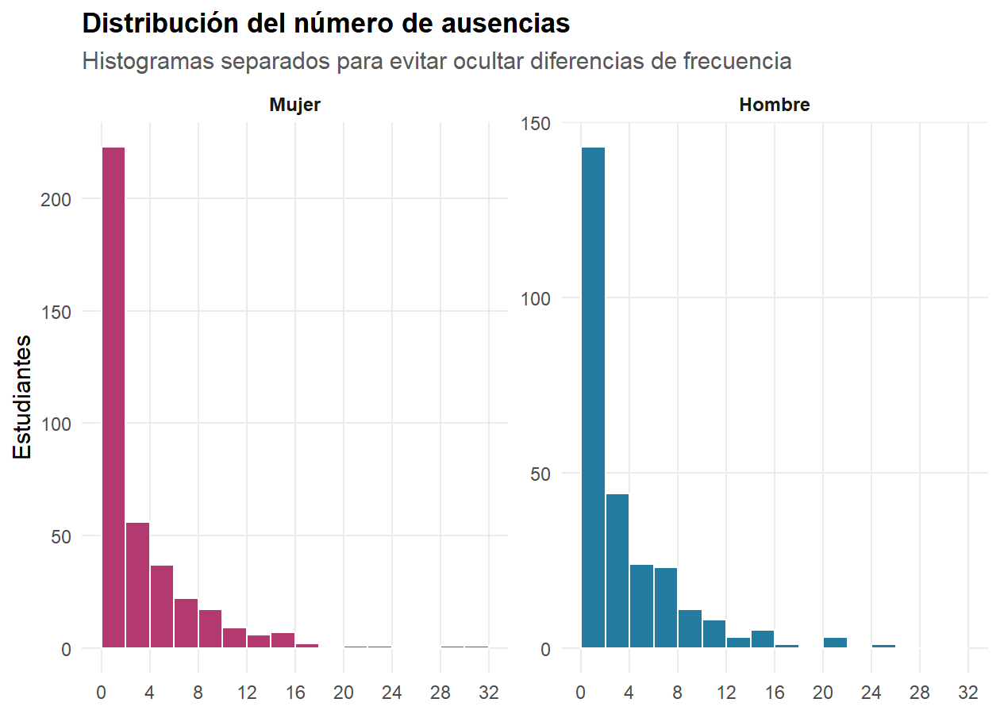
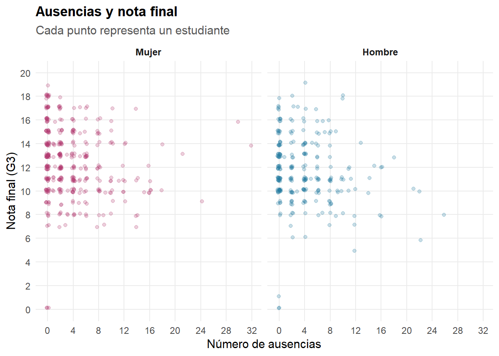

Vida social, ausencias y rendimiento académico
================
Proyecto Métodos Estadísticos Avanzados I
08/08/2026

# Presentación

## Pregunta de investigación

> **¿Qué relación existe entre salir con amigos, consumir alcohol los
> fines de semana y las ausencias escolares con el rendimiento
> académico, considerando el sexo del estudiante?**

El objetivo es describir la asociación entre la frecuencia de salir con
amigos (`goout`), el consumo de alcohol durante el fin de semana
(`Walc`), el número de ausencias (`absences`) y la nota final de
portugués (`G3`), comparando mujeres y hombres. Como los datos son
observacionales, se habla de **asociación**, no de causalidad.

## Variables

| Variable | Papel | Tipo y escala |
|:---|:---|:---|
| `G3` | Rendimiento académico | Cuantitativa discreta, de 0 a 20 |
| `absences` | Inasistencia escolar | Cuantitativa discreta, número de ausencias |
| `goout` | Frecuencia de salir con amigos | Ordinal: 1 = muy baja, 5 = muy alta |
| `Walc` | Consumo de alcohol el fin de semana | Ordinal: 1 = muy bajo, 5 = muy alto |
| `sex` | Variable de comparación | Nominal: F = mujer, M = hombre |

`G3` y `absences` satisfacen el requisito de incluir al menos dos
variables cuantitativas. `goout` y `Walc` se conservan como variables
ordinales, aunque estén codificadas con números.

# Carga y revisión de los datos

La base contiene **649 estudiantes**, **33 variables**, **0 datos
faltantes** y **0 filas exactamente duplicadas**. Se conservaron los
**15 valores `G3 = 0`** (2.3%), pues pertenecen al rango permitido por
el diccionario.

# Estadística descriptiva

| Variable              | Media | Mediana | Moda | Minimo | Maximo | Rango | Desviacion | Varianza |
|:----------------------|------:|--------:|-----:|-------:|-------:|------:|-----------:|---------:|
| Nota final (G3)       | 11.91 |      12 |   11 |      0 |     19 |    19 |       3.23 |    10.44 |
| Ausencias             |  3.66 |       2 |    0 |      0 |     32 |    32 |       4.64 |    21.54 |
| Salir con amigos      |  3.18 |       3 |    3 |      1 |      5 |     4 |       1.18 |     1.38 |
| Alcohol fin de semana |  2.28 |       2 |    1 |      1 |      5 |     4 |       1.28 |     1.65 |

Tabla 1. Resumen de las variables principales

La nota final tiene media **11.91** y mediana **12**. Las ausencias
presentan media **3.66**, mediana **2** y máximo **32**; la media mayor
que la mediana anticipa una distribución asimétrica hacia la derecha.

| Sexo | n | Porcentaje | Media_G3 | Mediana_G3 | Media_ausencias | Mediana_ausencias | Media_goout | Media_Walc |
|:---|---:|---:|---:|---:|---:|---:|---:|---:|
| Mujer | 383 | 59 | 12.25 | 12 | 3.58 | 2 | 3.13 | 1.94 |
| Hombre | 266 | 41 | 11.41 | 11 | 3.78 | 2 | 3.27 | 2.77 |

Tabla 2. Descripción por sexo

Las mujeres representan **59%** de la muestra. Su promedio de `G3` es
**12.25**, frente a **11.41** en hombres. El promedio de ausencias es
**3.58** en mujeres y **3.78** en hombres.

## Figura 1. Distribución de la nota final

Figura 1. Distribución de la nota final de portugués según el sexo.

**Interpretación.** La mayor concentración de notas se encuentra
aproximadamente entre 10 y 14. La distribución de las mujeres está
desplazada ligeramente hacia notas mayores: su media supera la de los
hombres en **0.84 puntos**. Sin embargo, las curvas se superponen
ampliamente, por lo que el sexo no separa por completo los resultados.
Los 15 ceros forman un grupo aislado visible en el extremo izquierdo.

## Figura 2. Distribución de las ausencias

Figura 2. Distribución de las ausencias escolares según el sexo.

**Interpretación.** En ambos sexos la distribución es asimétrica hacia
la derecha: muchos estudiantes tienen pocas o ninguna ausencia y pocos
alcanzan valores altos. La mediana es **2** para mujeres y **2** para
hombres. El máximo de 32 no es un dato imposible según el diccionario,
pero sí pertenece a la cola de la distribución.

## Figura 3. Ausencias y rendimiento

Figura 3. Nota final frente al número de ausencias, por sexo.

| Ausencias | n_mujer | media_mujer | n_hombre | media_hombre |
|:----------|--------:|------------:|---------:|-------------:|
| 0         |     142 |       12.59 |      102 |        11.27 |
| 1-2       |      81 |       12.57 |       41 |        11.51 |
| 3-5       |      66 |       11.83 |       46 |        11.96 |
| 6-10      |      66 |       12.02 |       56 |        11.66 |
| 11 o más  |      28 |       11.18 |       21 |         9.95 |

Tabla 3. Nota media por tramos de ausencias y sexo

**Interpretación.** La nube es muy dispersa: con un mismo número de
ausencias aparecen notas distintas. En los tramos de la tabla se observa
que **12.59** y **11.27** son las medias sin ausencias para mujeres y
hombres, respectivamente. En el tramo de 11 o más son **11.18** y
**9.95**. La ausencia de una caída uniforme advierte que la relación no
es fuerte ni estrictamente lineal.

## Figura 4. Rendimiento y frecuencia de salir con amigos

Figura 4. Nota final según la frecuencia de salir con amigos y el sexo.

| Nivel goout | Sexo   |   n | Media G3 | Media ausencias |
|:-----------:|:-------|----:|---------:|----------------:|
|      1      | Mujer  |  31 |    11.23 |            4.68 |
|      2      | Mujer  |  87 |    12.69 |            3.60 |
|      3      | Mujer  | 122 |    12.48 |            3.07 |
|      4      | Mujer  |  88 |    12.28 |            3.75 |
|      5      | Mujer  |  55 |    11.58 |            3.76 |
|      1      | Hombre |  17 |     9.82 |            1.41 |
|      2      | Hombre |  58 |    12.64 |            2.74 |
|      3      | Hombre |  83 |    11.66 |            3.23 |
|      4      | Hombre |  53 |    11.45 |            5.68 |
|      5      | Hombre |  55 |    10.16 |            4.60 |

Tabla 4. Promedios por frecuencia de salir y sexo

**Interpretación.** Las cajas se superponen ampliamente y no forman una
secuencia descendente perfecta. En mujeres, la media más alta aparece en
`goout = 2` (12.69) y en hombres también (12.64). El nivel 5 desciende a
11.58 y 10.16, respectivamente. Esto descarta una relación estrictamente
lineal y muestra que la caída en niveles altos es más visible entre los
hombres.

## Figura 5. Rendimiento y consumo de fin de semana

Figura 5. Nota final según consumo de alcohol de fin de semana y sexo.

| Nivel Walc | Sexo   |   n | Media G3 | Media ausencias |
|:----------:|:-------|----:|---------:|----------------:|
|     1      | Mujer  | 176 |    12.22 |            3.05 |
|     2      | Mujer  |  99 |    12.24 |            3.67 |
|     3      | Mujer  |  71 |    12.52 |            4.52 |
|     4      | Mujer  |  30 |    11.57 |            4.40 |
|     5      | Mujer  |   7 |    13.43 |            2.43 |
|     1      | Hombre |  71 |    12.70 |            2.49 |
|     2      | Hombre |  51 |    12.29 |            3.73 |
|     3      | Hombre |  49 |    10.43 |            3.00 |
|     4      | Hombre |  57 |    10.75 |            4.77 |
|     5      | Hombre |  38 |    10.03 |            5.76 |

Tabla 5. Promedios por consumo de fin de semana y sexo

**Interpretación.** En hombres, la media baja de 12.7 en `Walc = 1` a
10.03 en `Walc = 5`. En mujeres no hay descenso ordenado y el promedio
de `Walc = 5` es alto, pero ese grupo contiene solo **7 estudiantes**,
frente a 176 en el nivel 1. Por eso ese extremo no representa una
tendencia femenina estable. Las ausencias tampoco aumentan uniformemente
en todos los niveles.

## Figura 6. Relación entre salir y consumir alcohol

Figura 6. Distribución conjunta de goout y Walc dentro de cada sexo.

**Interpretación.** Las mayores frecuencias no están distribuidas al
azar. Entre las mujeres, la celda más frecuente es `goout = 3` y
`Walc = 1`, con **52 estudiantes**. Entre los hombres es `goout = 2`,
`Walc = 1`, con **27**. En el extremo `goout = 5`, `Walc = 5` aparecen
**22 hombres** y solo **4 mujeres**. Esto respalda que los consumos
altos se concentran con salidas frecuentes y que ese extremo es más
visible entre los hombres.

# Asociación estadística y comparación de grupos

| Relacion          |    Rho |        p |
|:------------------|-------:|---------:|
| goout - G3        | -0.105 |  = 0,007 |
| Walc - G3         | -0.171 | \< 0,001 |
| Ausencias - G3    | -0.159 | \< 0,001 |
| goout - Walc      |  0.372 | \< 0,001 |
| goout - Ausencias |  0.104 |  = 0,008 |
| Walc - Ausencias  |  0.145 | \< 0,001 |

Tabla 6. Correlaciones de Spearman

La relación más clara entre las variables explicativas es
`goout - Walc`, con rho = **0.372**. Respecto a `G3`, las correlaciones
son **-0.105** para `goout`, **-0.171** para `Walc` y **-0.159** para
ausencias. Sus magnitudes son pequeñas: hay tendencias, pero ninguna
variable presenta por sí sola una asociación fuerte con las notas.

| Comparacion                       | Prueba         | Estadistico |        p |
|:----------------------------------|:---------------|------------:|---------:|
| G3 entre niveles de goout         | Kruskal-Wallis |      19.766 | \< 0,001 |
| G3 entre niveles de Walc          | Kruskal-Wallis |      24.297 | \< 0,001 |
| G3 entre mujeres y hombres        | Wilcoxon       |   58916.500 | \< 0,001 |
| Ausencias entre mujeres y hombres | Wilcoxon       |   49640.500 |  = 0,568 |

Tabla 7. Comparaciones no paramétricas

Kruskal-Wallis indica si la distribución de `G3` difiere entre los cinco
niveles ordinales. Wilcoxon compara mujeres y hombres sin suponer
normalidad. La significación estadística debe leerse junto con las
gráficas y las diferencias observadas: con 649 casos, una diferencia
pequeña también puede producir un valor *p* bajo.

# Análisis de componentes principales y biplot

El PCA resume conjuntamente `goout`, `Walc`, `absences` y `G3`. Las
cuatro variables se estandarizan: cada una queda con media 0 y
desviación estándar 1, evitando que la escala 0-32 de ausencias domine a
las escalas 1-5.

| Componente | Autovalor | % de variabilidad | % acumulado |
|:-----------|----------:|------------------:|------------:|
| CP1        |     1.535 |              38.4 |        38.4 |
| CP2        |     0.961 |              24.0 |        62.4 |
| CP3        |     0.908 |              22.7 |        85.1 |
| CP4        |     0.596 |              14.9 |       100.0 |

Tabla 8. Variabilidad explicada por los componentes principales

## ¿Qué significa el porcentaje de variabilidad explicado?

Al estandarizar cuatro variables, la variabilidad total equivale a **4
unidades**. El autovalor de cada componente indica cuántas de esas
unidades resume y su porcentaje se calcula como:

> porcentaje del componente = autovalor del componente / suma de los
> cuatro autovalores × 100.

La CP1 explica **38.4%**: es la proporción de las diferencias globales
entre estudiantes que puede verse sobre el eje horizontal. La CP2 añade
**24%** en una dirección perpendicular, sin repetir la información de
CP1. Juntas conservan **62.4%** de la variabilidad original; el
**37.6%** restante queda fuera del plano y pertenece a CP3 y CP4. Por
eso el biplot es un resumen útil, pero no una representación completa.

Figura 7. Biplot de goout, Walc, ausencias y G3, coloreado por sexo.

|          | Variable              |    CP1 |    CP2 |
|:---------|:----------------------|-------:|-------:|
| goout    | Salir con amigos      | -0.581 |  0.486 |
| Walc     | Alcohol fin de semana | -0.642 |  0.216 |
| absences | Ausencias             | -0.342 | -0.649 |
| G3       | Nota G3               |  0.365 |  0.544 |

Tabla 9. Cargas de las variables en CP1 y CP2

**Interpretación del biplot.** Las flechas de `Salir` y `Alcohol`
apuntan en direcciones próximas, en concordancia con su correlación
positiva. `Nota G3` se proyecta parcialmente en dirección contraria,
coherente con las asociaciones negativas débiles. `Ausencias` forma un
ángulo distinto y aporta información que no queda recogida por completo
en el eje de vida social. Las elipses se superponen ampliamente: los
perfiles multivariados de mujeres y hombres no constituyen grupos
separados. Esta lectura se limita al **62.4%** visible en CP1 y CP2.

# Conclusiones

1.  Salir con amigos y consumir alcohol los fines de semana presentan la
    asociación más clara entre las variables estudiadas.
2.  `goout`, `Walc` y `absences` muestran asociaciones débiles con la
    nota final; ninguna permite anticipar por sí sola el rendimiento
    individual.
3.  Las notas de las mujeres son ligeramente mayores en promedio, pero
    las distribuciones de ambos sexos se superponen ampliamente.
4.  El patrón entre consumo y nota parece más marcado entre los hombres,
    mientras que entre las mujeres es menos regular.
5.  Las ausencias son muy asimétricas y su relación con `G3` no es
    uniforme: existen notas altas y bajas incluso con cantidades
    similares de ausencias.
6.  El PCA comprime cuatro variables en dos ejes y conserva 62.4% de su
    variabilidad; el porcentaje restante no se observa en el biplot.
7.  Los resultados describen asociaciones de una base observacional y no
    demuestran que estos comportamientos causen cambios en las notas.
